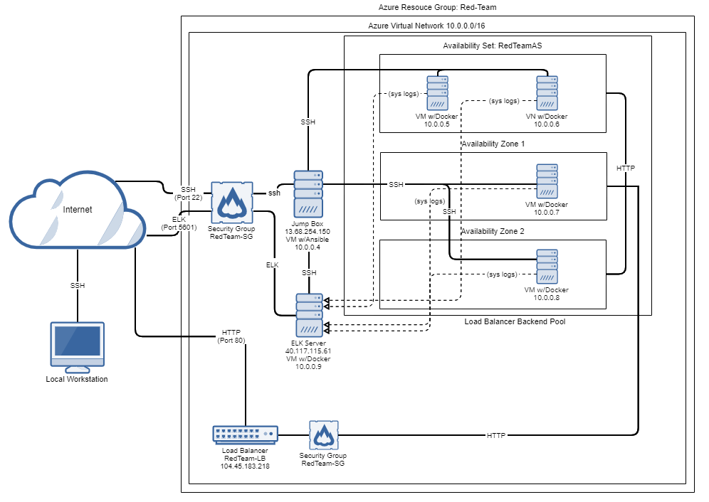
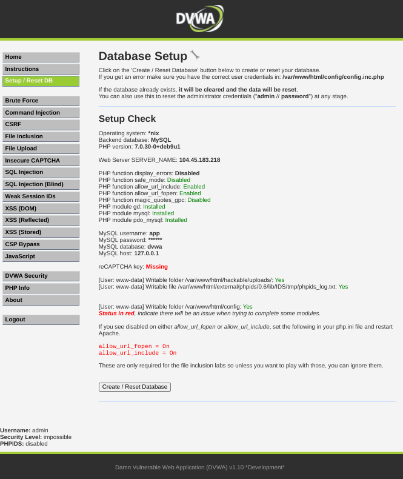
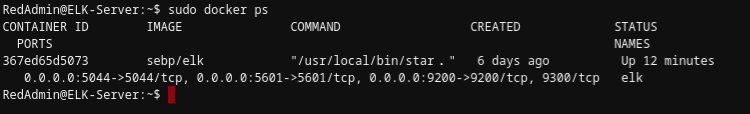
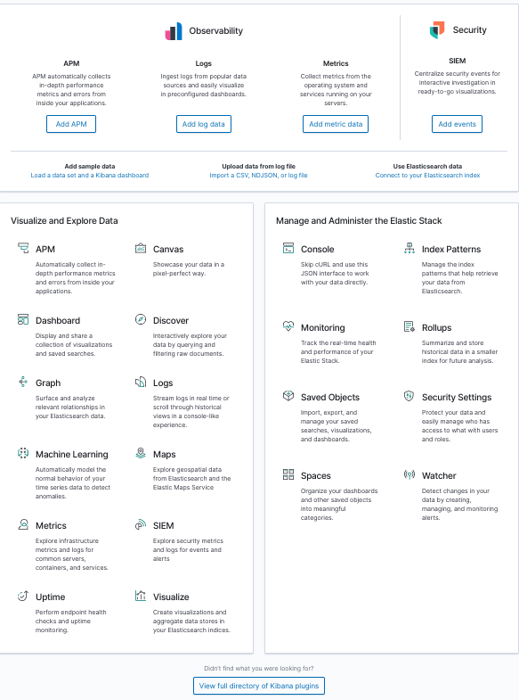
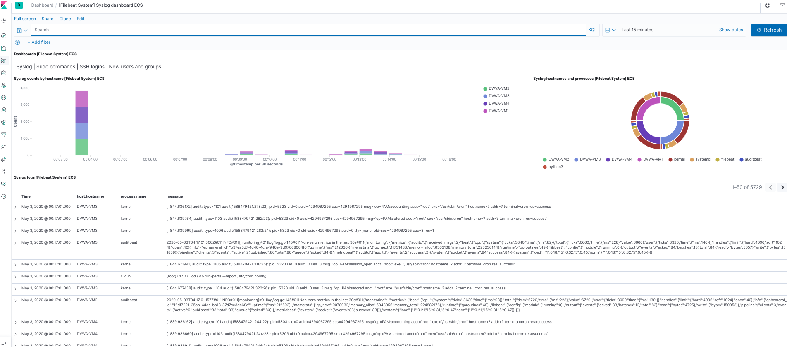
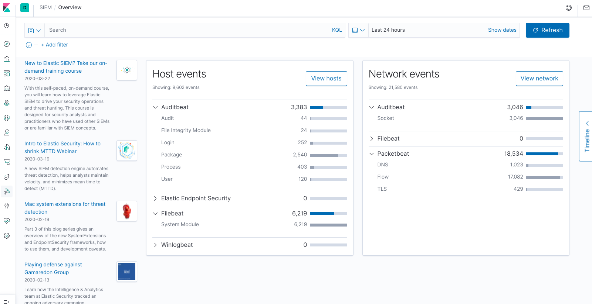
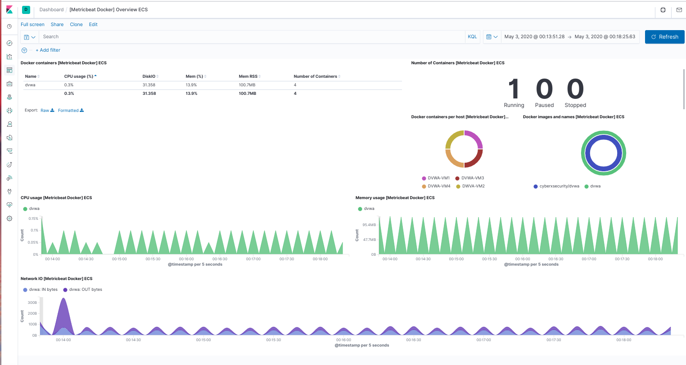
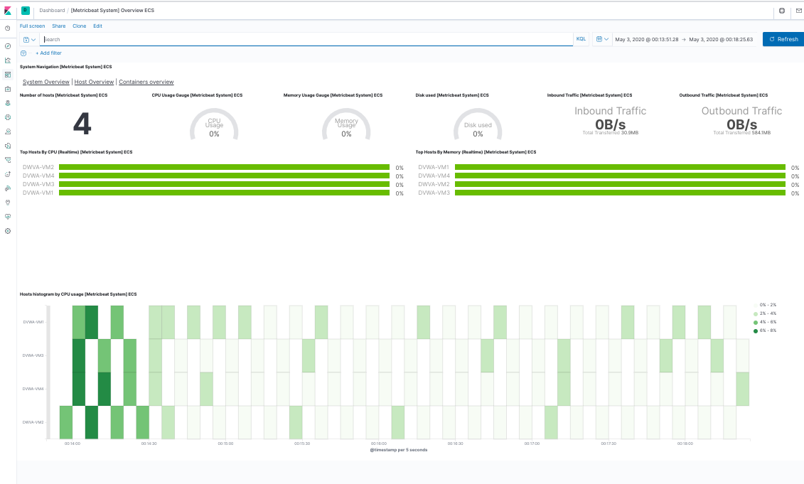

## Automated ELK Stack Deployment

The files in this repository were used to configure the network depicted below.

These files and folders have been tested and used to generate a live ELK deployment on Azure. They can be used to recreate the entire deployment pictured above. Otherwise, select portions of the YAML file may be used to install only certain pieces of it, such as Filebeat.

  - `main.yml`

  - `roles/` folder (including subfolders and their files)

This document contains the following details:

- [Description of the Topology](#description-of-the-topology)

- [Access Policies](#access-policies)

- [ELK Configuration](#elk-configuration)

- [Target Machines & Beats](#target-machines--beats)
  - Beats in Use
  - Machines Being Monitored

- [Using the Playbook](#using-the-playbook)

- [Checking the Installation](#checking-the-installation)

### Description of the Topology

The main purpose of this network is to expose a load-balanced and monitored instance of DVWA, the D*mn Vulnerable Web Application.

Load balancing ensures that the application will be highly available, in addition to restricting administrative access to the network.

Integrating an ELK server allows users to easily monitor the vulnerable VMs for changes to specific files such as system and event logs and system-level metrics.

The configuration details of each machine may be found below.

| Name       | Function    | IP Address | Operating System |
|------------|-------------|------------|------------------|
| Jump Box   | Gateway     | 10.0.0.4   | Ubuntu Server    |
| DVWA-VM1   | Webserver 1 | 10.0.0.5   | Ubuntu Server    |
| DVWA-VM2   | Webserver 2 | 10.0.0.6   | Ubuntu Server    |
| DVWA-VM3   | Webserver 3 | 10.0.0.7   | Ubuntu Server    |
| DVWA-VM4   | Webserver 4 | 10.0.0.8   | Ubuntu Server    |
| ELK Server | ELK Server  | 10.0.0.9   | Ubuntu Server    |

### Access Policies

The machines on the internal network are not exposed to the public internet. 

Only the Jump Box machine can accept connections from the internet. Access to this machine is only allowed from the following IP address: 184.148.xx.xx.

Machines within the network can only be accessed by the Jump Box machine (private IP address: 10.0.0.4).

A summary of the access policies in place can be found in the table below.

| Name       | Publicly Accessible | Allowed IP Addresses  |
|------------|---------------------|-----------------------|
| Jump Box   | Yes                 | 184.148.xx.xx         |
| DVWA-VM1   | No                  | 10.0.0.4              | 
| DVWA-VM2   | No                  | 10.0.0.4              |
| DVWA-VM3   | No                  | 10.0.0.4              |
| DVWA-VM4   | No                  | 10.0.0.4              |
| ELK Server | No                  | 10.0.0.4              |

### ELK Configuration

Ansible was used to automate the configuration of the ELK server. No configuration was performed manually. This automated provisioning drastically reduces the potential for human error. It can also simplify the process of configuring multiple servers identically at once.

The first part of the playbook implements the following tasks:

- Install docker
- Install python-pip
- Increase virtual memory of the server VM
- Download and install docker container `sebp/elk`

The following screenshot displays the result of running `sudo docker ps` after successfully configuring the ELK instance.

### Target Machines & Beats

This ELK server is configured to monitor the following machines:

- 10.0.0.5
- 10.0.0.6
- 10.0.0.7
- 10.0.0.8

We have installed the following Beats on these machines:

- Filebeat
- Metricbeat
- Packetbeat
- Auditbeat

These Beats allow us to collect the following information from each machine:

- Filebeat monitors the log files or locations on the server as specified, collects log events and forwards them to the ELK server

- Metricbeat monitors the system-level metrics of the server such as CPU/memory/disk usages, network IO statistics and statistics for all processes running on the system, and forward them to the ELK server

- Packetbeat monitors network traffic and sends the data to the ELK server, which will enable near real-time searches, analyses and visualization with the tools of Kibana

- Auditbeat audits the activities of users and processes on the system including changes to binary and configuration files and forwards the data to the ELK server for identifying potential security events and violations

### Using the Playbook

In order to use the playbook, you will need to have an Ansible control node already configured. Assuming you have such a control node provisioned: 

- SSH into the control node

- Copy the `ansible.cfg` file to `/etc/ansible/`, if it's not already there (you can use `cp [path to where you downloaded the file]/ansible.cfg /etc/ansible/`)

- Edit the `remote_user` of the `ansible.cfg` file to your user name (you can edit by `nano ansible.cfg`)

- Copy the hosts file to `/etc/ansible/`, if it's not already there (you can use `cp [path to where you downloaded the file]/hosts /etc/ansible/`)

- Edit the `/etc/ansible/hosts` file to include the IP addresses of the webservers and ELK servers in the specified sections (you can edit by `nano /etc/ansible/hosts`)

- Copy the `roles/` folder including all subfolders and files to `/etc/ansible/` (you can use `cp -R [path to where you downloaded the folder]/roles /etc/ansible/`)

- Copy the `main.yml` playbook file to `/etc/ansible/` (you can use `cp [path to where you saved the playbook file]/main.yml /etc/ansible/`)

- If desired, comment out the relevant lines of `main.yml` for the Beat tasks you do not need (e.g. `#  - install-packetbeat`)

- Run the playbook by the command `ansible-playbook main.yml`

### Checking the Installation

Starting up the ELK server usually takes about 5 minutes. By navigating to `http://[your ELK Server's public IP]:5601`, you can check if the installation worked as expected.

Kibana is a powerful visualization tool. You can configure it to produce a wide range of analyses and reports.

Below are some example reports you will be able to pull from the ELK server almost right away:

 

